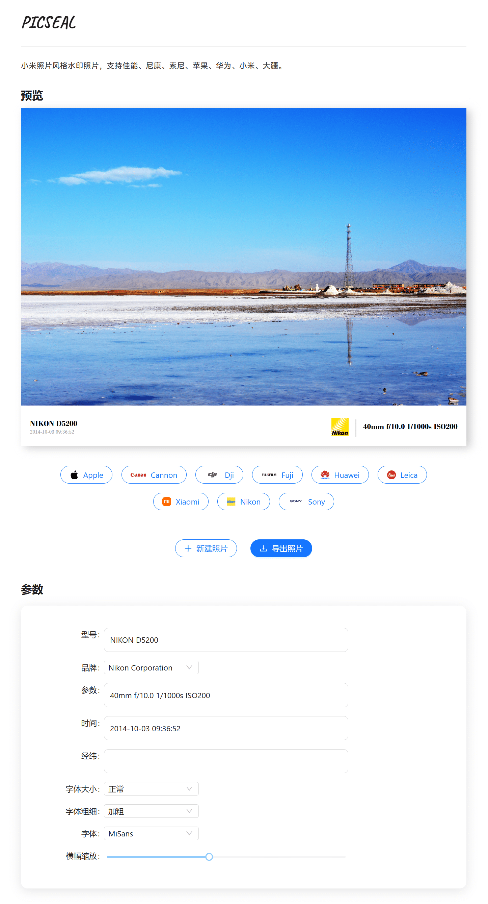

# Picseal

生成类似小米照片风格的莱卡水印照片。支持佳能、尼康、苹果、华为、小米、DJI 等设备的水印生成，可自动识别，也可自定义处理。

## 在线演示

在线试用地址：
- [picseal.vercel.app](https://picseal.vercel.app)
- [picseal.zhiweio.me](https://picseal.zhiweio.me)
- [zhiweio.github.io/picseal](https://zhiweio.github.io/picseal/)



## 技术实现

### EXIF 解析

使用了 Rust 库 `kamadak-exif` 从图片中提取得到 EXIF 信息并借助 WASM 技术嵌入前端 JavaScript 使用。

### 水印生成

通过 HTML 和 CSS 生成水印样式，能够做到动态调整实时预览。

### 图片生成

导出的图片是通过 `dom-to-image` JavaScript 库来将 DOM 转 JPEG/PNG 等格式图片，请注意这种实现生成的是和原图完全不一样的图片，可以看作屏幕截图的方式。

目前针对 JPEG 格式图片新增了复制原图 EXIF 信息嵌进导出的图片中，目前的实现方式比较简单粗暴，直接从原图二进制数据提取 EXIF 部分的数据，再同样以二进制格式进行拼接，不能确保稳定。

### 改进

- [ ] 改用 Rust `little_exif` 库来实现对图片 EXIF 信息的读取和编辑。
- [ ] 改用 Canvas 来实现水印，支持高度自定义。

## 部署方法

### 使用 Vercel 部署

|           一键部署到 Vercel            |
| :-----------------------------------: |
| [![][deploy-button-image]][deploy-link] |

### 本地部署

1. **克隆项目代码**：
   ```bash
   git clone https://github.com/zhiweio/picseal
   ```

2. **安装依赖**：
   ```bash
   # 安装 Rustup（编译器）
   curl --proto '=https' --tlsv1.2 -sSf https://sh.rustup.rs | sh -s -- -y

   # 安装 wasm-pack
   curl https://rustwasm.github.io/wasm-pack/installer/init.sh -sSf | sh -s -- -y
   ```

3. **构建并运行**：
   ```bash
   npm install
   npm run build
   npm run preview
   ```

### 使用 GitHub Pages 部署

1. 修改 `vite.config.ts` 中的 `base` 配置为你的 GitHub Pages URL（例如：`https://<USERNAME>.github.io/<REPO>/`）：
   ```javascript
   import wasm from 'vite-plugin-wasm'

   export default defineConfig({
     plugins: [
       react(),
       wasm(),
       topLevelAwait(),
       visualizer({ open: true }),
     ],
     server: {
       port: 3000,
     },
     build: {
       outDir: 'dist',
       target: 'esnext',
     },
     optimizeDeps: {
       exclude: ['picseal'],
     },
     base: 'https://zhiweio.github.io/picseal/',
   })
   ```

2. **构建并部署**：
   ```bash
   npm install
   npm run pages
   ```

### 使用 Docker 部署

1. 拉取镜像
   ```bash
   docker pull zhiweio/picseal:latest
   ```

2. 启动容器
   ```bash
   docker run -d -p 8080:80 picseal
   ```

3. 访问 http://localhost:8080

## 作者

- [@Wang Zhiwei](https://github.com/zhiweio)

## 开源协议

[MIT](https://choosealicense.com/licenses/mit/)

<!-- 链接配置 -->
[deploy-button-image]: https://vercel.com/button
[deploy-link]: https://vercel.com/new/clone?repository-url=https%3A%2F%2Fgithub.com%2Fzhiweio%2Fpicseal&project-name=picseal&repository-name=picseal
